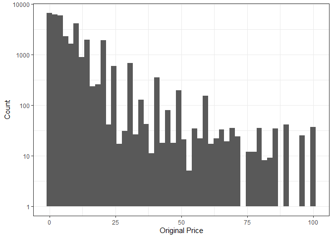
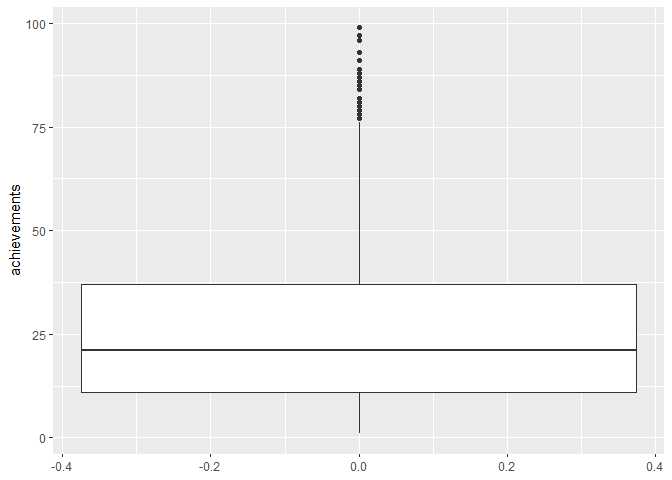
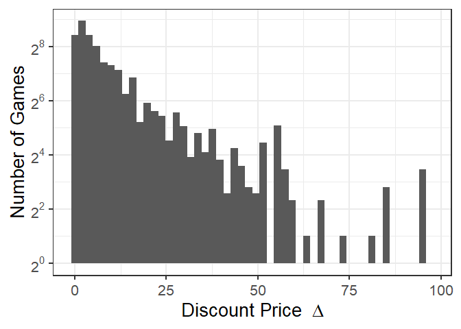
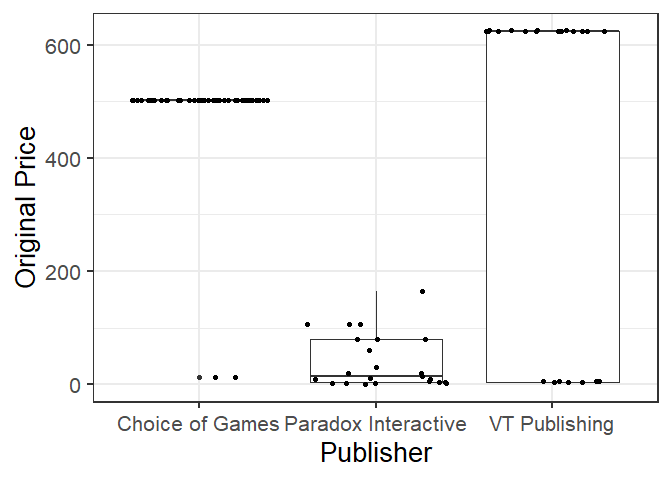
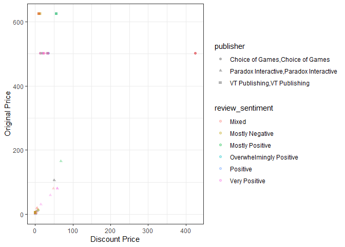
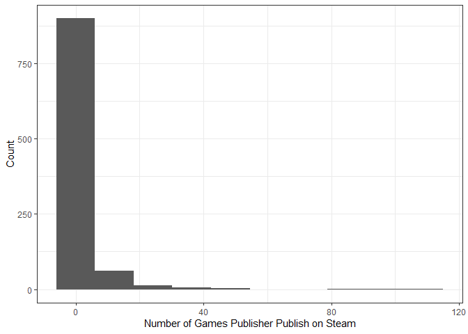
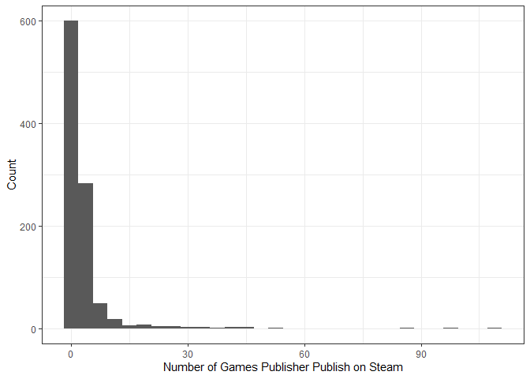
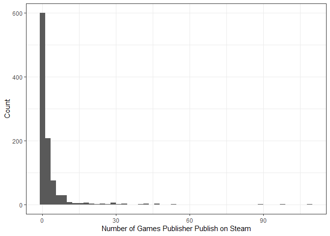

Mini Data-Analysis Deliverable 1
================

# Welcome to your (maybe) first-ever data analysis project!

And hopefully the first of many. Let’s get started:

1.  Install the [`datateachr`](https://github.com/UBC-MDS/datateachr)
    package by typing the following into your **R terminal**:

<!-- -->

    install.packages("devtools")
    devtools::install_github("UBC-MDS/datateachr")

2.  Load the packages below.

``` r
library(datateachr)
library(tidyverse)
```

    ## -- Attaching packages --------------------------------------- tidyverse 1.3.2 --
    ## v ggplot2 3.3.6      v purrr   0.3.4 
    ## v tibble  3.1.8      v dplyr   1.0.10
    ## v tidyr   1.2.1      v stringr 1.4.1 
    ## v readr   2.1.2      v forcats 0.5.2

    ## Warning: package 'purrr' was built under R version 3.6.3

    ## -- Conflicts ------------------------------------------ tidyverse_conflicts() --
    ## x dplyr::filter() masks stats::filter()
    ## x dplyr::lag()    masks stats::lag()

3.  Make a repository in the <https://github.com/stat545ubc-2022>
    Organization. You will be working with this repository for the
    entire data analysis project. You can either make it public, or make
    it private and add the TA’s and Lucy as collaborators. A link to
    help you create a private repository is available on the
    \#collaborative-project Slack channel.

# Instructions

## For Both Milestones

-   Each milestone is worth 45 points. The number of points allocated to
    each task will be annotated within each deliverable. Tasks that are
    more challenging will often be allocated more points.

-   10 points will be allocated to the reproducibility, cleanliness, and
    coherence of the overall analysis. While the two milestones will be
    submitted as independent deliverables, the analysis itself is a
    continuum - think of it as two chapters to a story. Each chapter, or
    in this case, portion of your analysis, should be easily followed
    through by someone unfamiliar with the content.
    [Here](https://swcarpentry.github.io/r-novice-inflammation/06-best-practices-R/)
    is a good resource for what constitutes “good code”. Learning good
    coding practices early in your career will save you hassle later on!

## For Milestone 1

**To complete this milestone**, edit [this very `.Rmd`
file](https://raw.githubusercontent.com/UBC-STAT/stat545.stat.ubc.ca/master/content/mini-project/mini-project-1.Rmd)
directly. Fill in the sections that are tagged with
`<!--- start your work below --->`.

**To submit this milestone**, make sure to knit this `.Rmd` file to an
`.md` file by changing the YAML output settings from
`output: html_document` to `output: github_document`. Commit and push
all of your work to the mini-analysis GitHub repository you made
earlier, and tag a release on GitHub. Then, submit a link to your tagged
release on canvas.

**Points**: This milestone is worth 45 points: 43 for your analysis, 1
point for having your Milestone 1 document knit error-free, and 1 point
for tagging your release on Github.

# Learning Objectives

By the end of this milestone, you should:

-   Become familiar with your dataset of choosing
-   Select 4 questions that you would like to answer with your data
-   Generate a reproducible and clear report using R Markdown
-   Become familiar with manipulating and summarizing your data in
    tibbles using `dplyr`, with a research question in mind.

# Task 1: Choose your favorite dataset (10 points)

The `datateachr` package by Hayley Boyce and Jordan Bourak currently
composed of 7 semi-tidy datasets for educational purposes. Here is a
brief description of each dataset:

-   *apt\_buildings*: Acquired courtesy of The City of Toronto’s Open
    Data Portal. It currently has 3455 rows and 37 columns.

-   *building\_permits*: Acquired courtesy of The City of Vancouver’s
    Open Data Portal. It currently has 20680 rows and 14 columns.

-   *cancer\_sample*: Acquired courtesy of UCI Machine Learning
    Repository. It currently has 569 rows and 32 columns.

-   *flow\_sample*: Acquired courtesy of The Government of Canada’s
    Historical Hydrometric Database. It currently has 218 rows and 7
    columns.

-   *parking\_meters*: Acquired courtesy of The City of Vancouver’s Open
    Data Portal. It currently has 10032 rows and 22 columns.

-   *steam\_games*: Acquired courtesy of Kaggle. It currently has 40833
    rows and 21 columns.

-   *vancouver\_trees*: Acquired courtesy of The City of Vancouver’s
    Open Data Portal. It currently has 146611 rows and 20 columns.

**Things to keep in mind**

-   We hope that this project will serve as practice for carrying our
    your own *independent* data analysis. Remember to comment your code,
    be explicit about what you are doing, and write notes in this
    markdown document when you feel that context is required. As you
    advance in the project, prompts and hints to do this will be
    diminished - it’ll be up to you!

-   Before choosing a dataset, you should always keep in mind **your
    goal**, or in other ways, *what you wish to achieve with this data*.
    This mini data-analysis project focuses on *data wrangling*,
    *tidying*, and *visualization*. In short, it’s a way for you to get
    your feet wet with exploring data on your own.

And that is exactly the first thing that you will do!

1.1 Out of the 7 datasets available in the `datateachr` package, choose
**4** that appeal to you based on their description. Write your choices
below:

**Note**: We encourage you to use the ones in the `datateachr` package,
but if you have a dataset that you’d really like to use, you can include
it here. But, please check with a member of the teaching team to see
whether the dataset is of appropriate complexity. Also, include a
**brief** description of the dataset here to help the teaching team
understand your data.

<!-------------------------- Start your work below ---------------------------->

1: cancer\_sample 2: steam\_games 3: vancouver\_trees 4: apt\_buildings

<!----------------------------------------------------------------------------->

1.2 One way to narrowing down your selection is to *explore* the
datasets. Use your knowledge of dplyr to find out at least *3*
attributes about each of these datasets (an attribute is something such
as number of rows, variables, class type…). The goal here is to have an
idea of *what the data looks like*.

*Hint:* This is one of those times when you should think about the
cleanliness of your analysis. I added a single code chunk for you below,
but do you want to use more than one? Would you like to write more
comments outside of the code chunk?

<!-------------------------- Start your work below ---------------------------->

``` r
### EXPLORE HERE ###
glimpse(cancer_sample)
```

    ## Rows: 569
    ## Columns: 32
    ## $ ID                      <dbl> 842302, 842517, 84300903, 84348301, 84358402, ~
    ## $ diagnosis               <chr> "M", "M", "M", "M", "M", "M", "M", "M", "M", "~
    ## $ radius_mean             <dbl> 17.990, 20.570, 19.690, 11.420, 20.290, 12.450~
    ## $ texture_mean            <dbl> 10.38, 17.77, 21.25, 20.38, 14.34, 15.70, 19.9~
    ## $ perimeter_mean          <dbl> 122.80, 132.90, 130.00, 77.58, 135.10, 82.57, ~
    ## $ area_mean               <dbl> 1001.0, 1326.0, 1203.0, 386.1, 1297.0, 477.1, ~
    ## $ smoothness_mean         <dbl> 0.11840, 0.08474, 0.10960, 0.14250, 0.10030, 0~
    ## $ compactness_mean        <dbl> 0.27760, 0.07864, 0.15990, 0.28390, 0.13280, 0~
    ## $ concavity_mean          <dbl> 0.30010, 0.08690, 0.19740, 0.24140, 0.19800, 0~
    ## $ concave_points_mean     <dbl> 0.14710, 0.07017, 0.12790, 0.10520, 0.10430, 0~
    ## $ symmetry_mean           <dbl> 0.2419, 0.1812, 0.2069, 0.2597, 0.1809, 0.2087~
    ## $ fractal_dimension_mean  <dbl> 0.07871, 0.05667, 0.05999, 0.09744, 0.05883, 0~
    ## $ radius_se               <dbl> 1.0950, 0.5435, 0.7456, 0.4956, 0.7572, 0.3345~
    ## $ texture_se              <dbl> 0.9053, 0.7339, 0.7869, 1.1560, 0.7813, 0.8902~
    ## $ perimeter_se            <dbl> 8.589, 3.398, 4.585, 3.445, 5.438, 2.217, 3.18~
    ## $ area_se                 <dbl> 153.40, 74.08, 94.03, 27.23, 94.44, 27.19, 53.~
    ## $ smoothness_se           <dbl> 0.006399, 0.005225, 0.006150, 0.009110, 0.0114~
    ## $ compactness_se          <dbl> 0.049040, 0.013080, 0.040060, 0.074580, 0.0246~
    ## $ concavity_se            <dbl> 0.05373, 0.01860, 0.03832, 0.05661, 0.05688, 0~
    ## $ concave_points_se       <dbl> 0.015870, 0.013400, 0.020580, 0.018670, 0.0188~
    ## $ symmetry_se             <dbl> 0.03003, 0.01389, 0.02250, 0.05963, 0.01756, 0~
    ## $ fractal_dimension_se    <dbl> 0.006193, 0.003532, 0.004571, 0.009208, 0.0051~
    ## $ radius_worst            <dbl> 25.38, 24.99, 23.57, 14.91, 22.54, 15.47, 22.8~
    ## $ texture_worst           <dbl> 17.33, 23.41, 25.53, 26.50, 16.67, 23.75, 27.6~
    ## $ perimeter_worst         <dbl> 184.60, 158.80, 152.50, 98.87, 152.20, 103.40,~
    ## $ area_worst              <dbl> 2019.0, 1956.0, 1709.0, 567.7, 1575.0, 741.6, ~
    ## $ smoothness_worst        <dbl> 0.1622, 0.1238, 0.1444, 0.2098, 0.1374, 0.1791~
    ## $ compactness_worst       <dbl> 0.6656, 0.1866, 0.4245, 0.8663, 0.2050, 0.5249~
    ## $ concavity_worst         <dbl> 0.71190, 0.24160, 0.45040, 0.68690, 0.40000, 0~
    ## $ concave_points_worst    <dbl> 0.26540, 0.18600, 0.24300, 0.25750, 0.16250, 0~
    ## $ symmetry_worst          <dbl> 0.4601, 0.2750, 0.3613, 0.6638, 0.2364, 0.3985~
    ## $ fractal_dimension_worst <dbl> 0.11890, 0.08902, 0.08758, 0.17300, 0.07678, 0~

``` r
glimpse(steam_games)
```

    ## Rows: 40,833
    ## Columns: 21
    ## $ id                       <dbl> 1, 2, 3, 4, 5, 6, 7, 8, 9, 10, 11, 12, 13, 14~
    ## $ url                      <chr> "https://store.steampowered.com/app/379720/DO~
    ## $ types                    <chr> "app", "app", "app", "app", "app", "bundle", ~
    ## $ name                     <chr> "DOOM", "PLAYERUNKNOWN'S BATTLEGROUNDS", "BAT~
    ## $ desc_snippet             <chr> "Now includes all three premium DLC packs (Un~
    ## $ recent_reviews           <chr> "Very Positive,(554),- 89% of the 554 user re~
    ## $ all_reviews              <chr> "Very Positive,(42,550),- 92% of the 42,550 u~
    ## $ release_date             <chr> "May 12, 2016", "Dec 21, 2017", "Apr 24, 2018~
    ## $ developer                <chr> "id Software", "PUBG Corporation", "Harebrain~
    ## $ publisher                <chr> "Bethesda Softworks,Bethesda Softworks", "PUB~
    ## $ popular_tags             <chr> "FPS,Gore,Action,Demons,Shooter,First-Person,~
    ## $ game_details             <chr> "Single-player,Multi-player,Co-op,Steam Achie~
    ## $ languages                <chr> "English,French,Italian,German,Spanish - Spai~
    ## $ achievements             <dbl> 54, 37, 128, NA, NA, NA, 51, 55, 34, 43, 72, ~
    ## $ genre                    <chr> "Action", "Action,Adventure,Massively Multipl~
    ## $ game_description         <chr> "About This Game Developed by id software, th~
    ## $ mature_content           <chr> NA, "Mature Content Description  The develope~
    ## $ minimum_requirements     <chr> "Minimum:,OS:,Windows 7/8.1/10 (64-bit versio~
    ## $ recommended_requirements <chr> "Recommended:,OS:,Windows 7/8.1/10 (64-bit ve~
    ## $ original_price           <dbl> 19.99, 29.99, 39.99, 44.99, 0.00, NA, 59.99, ~
    ## $ discount_price           <dbl> 14.99, NA, NA, NA, NA, 35.18, 70.42, 17.58, N~

``` r
glimpse(vancouver_trees)
```

    ## Rows: 146,611
    ## Columns: 20
    ## $ tree_id            <dbl> 149556, 149563, 149579, 149590, 149604, 149616, 149~
    ## $ civic_number       <dbl> 494, 450, 4994, 858, 5032, 585, 4909, 4925, 4969, 7~
    ## $ std_street         <chr> "W 58TH AV", "W 58TH AV", "WINDSOR ST", "E 39TH AV"~
    ## $ genus_name         <chr> "ULMUS", "ZELKOVA", "STYRAX", "FRAXINUS", "ACER", "~
    ## $ species_name       <chr> "AMERICANA", "SERRATA", "JAPONICA", "AMERICANA", "C~
    ## $ cultivar_name      <chr> "BRANDON", NA, NA, "AUTUMN APPLAUSE", NA, "CHANTICL~
    ## $ common_name        <chr> "BRANDON ELM", "JAPANESE ZELKOVA", "JAPANESE SNOWBE~
    ## $ assigned           <chr> "N", "N", "N", "Y", "N", "N", "N", "N", "N", "N", "~
    ## $ root_barrier       <chr> "N", "N", "N", "N", "N", "N", "N", "N", "N", "N", "~
    ## $ plant_area         <chr> "N", "N", "4", "4", "4", "B", "6", "6", "3", "3", "~
    ## $ on_street_block    <dbl> 400, 400, 4900, 800, 5000, 500, 4900, 4900, 4900, 7~
    ## $ on_street          <chr> "W 58TH AV", "W 58TH AV", "WINDSOR ST", "E 39TH AV"~
    ## $ neighbourhood_name <chr> "MARPOLE", "MARPOLE", "KENSINGTON-CEDAR COTTAGE", "~
    ## $ street_side_name   <chr> "EVEN", "EVEN", "EVEN", "EVEN", "EVEN", "ODD", "ODD~
    ## $ height_range_id    <dbl> 2, 4, 3, 4, 2, 2, 3, 3, 2, 2, 2, 5, 3, 2, 2, 2, 2, ~
    ## $ diameter           <dbl> 10.00, 10.00, 4.00, 18.00, 9.00, 5.00, 15.00, 14.00~
    ## $ curb               <chr> "N", "N", "Y", "Y", "Y", "Y", "Y", "Y", "Y", "Y", "~
    ## $ date_planted       <date> 1999-01-13, 1996-05-31, 1993-11-22, 1996-04-29, 19~
    ## $ longitude          <dbl> -123.1161, -123.1147, -123.0846, -123.0870, -123.08~
    ## $ latitude           <dbl> 49.21776, 49.21776, 49.23938, 49.23469, 49.23894, 4~

``` r
glimpse(apt_buildings)
```

    ## Rows: 3,455
    ## Columns: 37
    ## $ id                               <dbl> 10359, 10360, 10361, 10362, 10363, 10~
    ## $ air_conditioning                 <chr> "NONE", "NONE", "NONE", "NONE", "NONE~
    ## $ amenities                        <chr> "Outdoor rec facilities", "Outdoor po~
    ## $ balconies                        <chr> "YES", "YES", "YES", "YES", "NO", "NO~
    ## $ barrier_free_accessibilty_entr   <chr> "YES", "NO", "NO", "YES", "NO", "NO",~
    ## $ bike_parking                     <chr> "0 indoor parking spots and 10 outdoo~
    ## $ exterior_fire_escape             <chr> "NO", "NO", "NO", "YES", "NO", NA, "N~
    ## $ fire_alarm                       <chr> "YES", "YES", "YES", "YES", "YES", "Y~
    ## $ garbage_chutes                   <chr> "YES", "YES", "NO", "NO", "NO", "NO",~
    ## $ heating_type                     <chr> "HOT WATER", "HOT WATER", "HOT WATER"~
    ## $ intercom                         <chr> "YES", "YES", "YES", "YES", "YES", "Y~
    ## $ laundry_room                     <chr> "YES", "YES", "YES", "YES", "YES", "Y~
    ## $ locker_or_storage_room           <chr> "NO", "YES", "YES", "YES", "NO", "YES~
    ## $ no_of_elevators                  <dbl> 3, 3, 0, 1, 0, 0, 0, 2, 4, 2, 0, 2, 2~
    ## $ parking_type                     <chr> "Underground Garage , Garage accessib~
    ## $ pets_allowed                     <chr> "YES", "YES", "YES", "YES", "YES", "Y~
    ## $ prop_management_company_name     <chr> NA, "SCHICKEDANZ BROS. PROPERTIES", N~
    ## $ property_type                    <chr> "PRIVATE", "PRIVATE", "PRIVATE", "PRI~
    ## $ rsn                              <dbl> 4154812, 4154815, 4155295, 4155309, 4~
    ## $ separate_gas_meters              <chr> "NO", "NO", "NO", "NO", "NO", "NO", "~
    ## $ separate_hydro_meters            <chr> "YES", "YES", "YES", "YES", "YES", "Y~
    ## $ separate_water_meters            <chr> "NO", "NO", "NO", "NO", "NO", "NO", "~
    ## $ site_address                     <chr> "65  FOREST MANOR RD", "70  CLIPPER R~
    ## $ sprinkler_system                 <chr> "YES", "YES", "NO", "YES", "NO", "NO"~
    ## $ visitor_parking                  <chr> "PAID", "FREE", "UNAVAILABLE", "UNAVA~
    ## $ ward                             <chr> "17", "17", "03", "03", "02", "02", "~
    ## $ window_type                      <chr> "DOUBLE PANE", "DOUBLE PANE", "DOUBLE~
    ## $ year_built                       <dbl> 1967, 1970, 1927, 1959, 1943, 1952, 1~
    ## $ year_registered                  <dbl> 2017, 2017, 2017, 2017, 2017, NA, 201~
    ## $ no_of_storeys                    <dbl> 17, 14, 4, 5, 4, 4, 4, 7, 32, 4, 4, 7~
    ## $ emergency_power                  <chr> "NO", "YES", "NO", "NO", "NO", "NO", ~
    ## $ `non-smoking_building`           <chr> "YES", "NO", "YES", "YES", "YES", "NO~
    ## $ no_of_units                      <dbl> 218, 206, 34, 42, 25, 34, 14, 105, 57~
    ## $ no_of_accessible_parking_spaces  <dbl> 8, 10, 20, 42, 12, 0, 5, 1, 1, 6, 12,~
    ## $ facilities_available             <chr> "Recycling bins", "Green Bin / Organi~
    ## $ cooling_room                     <chr> "NO", "NO", "NO", "NO", "NO", "NO", "~
    ## $ no_barrier_free_accessible_units <dbl> 2, 0, 0, 42, 0, NA, 14, 0, 0, 1, 25, ~

<!----------------------------------------------------------------------------->

1.3 Now that you’ve explored the 4 datasets that you were initially most
interested in, let’s narrow it down to 2. What lead you to choose these
2? Briefly explain your choices below, and feel free to include any code
in your explanation.

<!-------------------------- Start your work below ---------------------------->

I have narrowed my choices down to `cancer_sample` and `steam_games`. I
am a MSc student in Bioinformatics so studying cancer data is of great
interest. The `cancer_sample` dataset contains diagnosis so we can see
if there are trends that favour a malignant diagnosis vs benign
diagnosis. I am also an avid gamer, so data about games on steam, where
I purchase most of my games, are fascinating to me. I am very interested
in seeing if there are price trends that I can exploit.
<!----------------------------------------------------------------------------->

1.4 Time for the final decision! Going back to the beginning, it’s
important to have an *end goal* in mind. For example, if I had chosen
the `titanic` dataset for my project, I might’ve wanted to explore the
relationship between survival and other variables. Try to think of 1
research question that you would want to answer with each dataset. Note
them down below, and make your final choice based on what seems more
interesting to you!

<!-------------------------- Start your work below ---------------------------->

`cancer_sample`: How does the `area_mean`, `perimeter_mean`, and
`texture_mean` affect the `diagnosis`?

`steam_games`: I want to explore the relationships between `publisher`,
`all_reviews`, `original_price`, `discount_price`, and how these factors
affect each other.

I think the research question regarding the `steam_games` is more
interesting. The result of the analysis can also affect how I purchase
games in the future. If highly reviewed games do not have great
discounts, I might just buy the game on release instead of waiting. The
research questions posed with the `cancer_sample` dataset concerns the
shape and size of the tumour, which is not as interesting to me as the
underlying genomics.
<!----------------------------------------------------------------------------->

# Important note

Read Tasks 2 and 3 *fully* before starting to complete either of them.
Probably also a good point to grab a coffee to get ready for the fun
part!

This project is semi-guided, but meant to be *independent*. For this
reason, you will complete tasks 2 and 3 below (under the **START HERE**
mark) as if you were writing your own exploratory data analysis report,
and this guidance never existed! Feel free to add a brief introduction
section to your project, format the document with markdown syntax as you
deem appropriate, and structure the analysis as you deem appropriate.
Remember, marks will be awarded for completion of the 4 tasks, but 10
points of the whole project are allocated to a reproducible and clean
analysis. If you feel lost, you can find a sample data analysis
[here](https://www.kaggle.com/headsortails/tidy-titarnic) to have a
better idea. However, bear in mind that it is **just an example** and
you will not be required to have that level of complexity in your
project.

# Task 2: Exploring your dataset (15 points)

If we rewind and go back to the learning objectives, you’ll see that by
the end of this deliverable, you should have formulated *4* research
questions about your data that you may want to answer during your
project. However, it may be handy to do some more exploration on your
dataset of choice before creating these questions - by looking at the
data, you may get more ideas. **Before you start this task, read all
instructions carefully until you reach START HERE under Task 3**.

2.1 Complete *4 out of the following 8 exercises* to dive deeper into
your data. All datasets are different and therefore, not all of these
tasks may make sense for your data - which is why you should only answer
*4*. Use *dplyr* and *ggplot*.

1.  Plot the distribution of a numeric variable.
2.  Create a new variable based on other variables in your data (only if
    it makes sense)
3.  Investigate how many missing values there are per variable. Can you
    find a way to plot this?
4.  Explore the relationship between 2 variables in a plot.
5.  Filter observations in your data according to your own criteria.
    Think of what you’d like to explore - again, if this was the
    `titanic` dataset, I may want to narrow my search down to passengers
    born in a particular year…
6.  Use a boxplot to look at the frequency of different observations
    within a single variable. You can do this for more than one variable
    if you wish!
7.  Make a new tibble with a subset of your data, with variables and
    observations that you are interested in exploring.
8.  Use a density plot to explore any of your variables (that are
    suitable for this type of plot).

2.2 For each of the 4 exercises that you complete, provide a *brief
explanation* of why you chose that exercise in relation to your data (in
other words, why does it make sense to do that?), and sufficient
comments for a reader to understand your reasoning and code.

<!-------------------------- Start your work below ---------------------------->

Exercise 1: I am interested in the prices of games on Steam so I plotted
a distribution (histogram) of original game prices to see what most of
the games on Steam are sold for originally. As there are vastly more
games sold for cheaper prices, I used a log scale of the y-axis to
visualize the plot. As I only buy games that cost less than \$100, I
also filtered the dataset for prices cheaper than \$100.

``` r
steam_games %>%
  filter(original_price < 100) %>% # filter in games with original_price < 100
  ggplot(aes(x = original_price, y = ..count..)) + # plot histogran using the counts of original price
  geom_histogram(bins = 50) + #plot histogram using 50 bins
  scale_y_log10() + # using a logarithmic y-axis
  xlab("Original Price") + 
  ylab("Count") +
  theme_bw()
```

<!-- -->

Exercise 2: I am interested in the value of the discount, so I created a
new `discount_price_delta` column (`original_price` - `discount_price`).
I have also noticed it is possible for `discount_price_delta` to be
negative. I also removed these columns from the table.

``` r
steam_games <- #modify steam_games
  steam_games %>%
  mutate(discount_price_delta = original_price - discount_price) %>% # make new column called discount_price_delta using original_price - discount_price
  filter(discount_price_delta >= 0) # remove entries with negative discount_price_delta
glimpse(steam_games) # view modified steam_games
```

    ## Rows: 3,134
    ## Columns: 22
    ## $ id                       <dbl> 1, 29, 40, 44, 46, 48, 53, 54, 61, 64, 78, 81~
    ## $ url                      <chr> "https://store.steampowered.com/app/379720/DO~
    ## $ types                    <chr> "app", "app", "sub", "app", "app", "app", "ap~
    ## $ name                     <chr> "DOOM", "Neverwinter Nights: Enhanced Edition~
    ## $ desc_snippet             <chr> "Now includes all three premium DLC packs (Un~
    ## $ recent_reviews           <chr> "Very Positive,(554),- 89% of the 554 user re~
    ## $ all_reviews              <chr> "Very Positive,(42,550),- 92% of the 42,550 u~
    ## $ release_date             <chr> "May 12, 2016", "Mar 27, 2018", "NaN", "Oct 1~
    ## $ developer                <chr> "id Software", "Beamdog", "id Software", "Tan~
    ## $ publisher                <chr> "Bethesda Softworks,Bethesda Softworks", "Bea~
    ## $ popular_tags             <chr> "FPS,Gore,Action,Demons,Shooter,First-Person,~
    ## $ game_details             <chr> "Single-player,Multi-player,Co-op,Steam Achie~
    ## $ languages                <chr> "English,French,Italian,German,Spanish - Spai~
    ## $ achievements             <dbl> 54, NA, NA, 71, 12, 30, 45, NA, 48, NA, 10, N~
    ## $ genre                    <chr> "Action", "RPG", "Action", "Action", "Action,~
    ## $ game_description         <chr> "About This Game Developed by id software, th~
    ## $ mature_content           <chr> NA, NA, "NaN", NA, "Mature Content Descriptio~
    ## $ minimum_requirements     <chr> "Minimum:,OS:,Windows 7/8.1/10 (64-bit versio~
    ## $ recommended_requirements <chr> "Recommended:,OS:,Windows 7/8.1/10 (64-bit ve~
    ## $ original_price           <dbl> 19.99, 57.91, 14.99, 19.99, 6.99, 29.99, 14.9~
    ## $ discount_price           <dbl> 14.99, 46.26, 7.49, 9.99, 5.24, 14.99, 4.49, ~
    ## $ discount_price_delta     <dbl> 5.00, 11.65, 7.50, 10.00, 1.75, 15.00, 10.50,~

Exercise 6: Games have had in-game achievements for a long time. Steam
has provided gamers an easy way to access to viewing and comparing their
achievements versus their friends. I am interested to in seeing on the
maxmimum, minimum, and average numer of achievemments of games on steam.
To accomplish that I use a boxplot. While not directly related to
prices, I am still interested in summary statistics of number of
achievements, as they play a big part in how I play games these days.
Once I complete a game I really like, I tend to revisit the game and
complete as many achivements as I can. As a few games have an extremely
high number of achievements, I first filtered the dataset for games with
number of achievements less than 100.

``` r
steam_games %>%
  filter(achievements < 100) %>% # filter in games with # achievements < 100
  ggplot(aes(y = achievements)) + # use achievements variable for box plot
  geom_boxplot() # plot box plot
```

<!-- -->

Exercise 7: I selected games that Choice of Games, VT Publishing, and
Paradox Interative publish. I am interested in seeing the prices and how
well these games are received by other people so I subsetted the
`steam_games` dataset by filtering for games published by “Choice of
Games,Choice of Games”, “VT Publishing,VT Publishing”, “Paradox
Interactive,Paradox Interactive”, and kept the variables `name`,
`publisher`, `all_reviews`, `recent_reviews`, `original_price`, and
`discount_price` and saved the new dataset under a new tibble called
`cog_vt_para_games`.

``` r
cog_vt_para_games <- # make new tibble called cog_vt_para_games
  steam_games %>%
  filter(publisher %in% c("Choice of Games,Choice of Games", # filter for interested publishers
                          "VT Publishing,VT Publishing",
                          "Paradox Interactive,Paradox Interactive")) %>%
  select(name, publisher, all_reviews, recent_reviews, original_price, discount_price) # keeping relevant variables
glimpse(cog_vt_para_games) # view cog_vt_para_games
```

    ## Rows: 232
    ## Columns: 6
    ## $ name           <chr> "Pillars of Eternity", "Tyranny", "Magicka", "Magicka 2~
    ## $ publisher      <chr> "Paradox Interactive,Paradox Interactive", "Paradox Int~
    ## $ all_reviews    <chr> "Very Positive,(8,015),- 84% of the 8,015 user reviews ~
    ## $ recent_reviews <chr> "Very Positive,(60),- 85% of the 60 user reviews in the~
    ## $ original_price <dbl> 59.98, 29.99, 9.99, 105.72, 79.95, 79.95, 501.87, 19.99~
    ## $ discount_price <dbl> 40.48, 14.99, 2.49, 50.39, 58.45, 48.67, 13.57, 4.99, 2~

<!----------------------------------------------------------------------------->

# Task 3: Write your research questions (5 points)

So far, you have chosen a dataset and gotten familiar with it through
exploring the data. Now it’s time to figure out 4 research questions
that you would like to answer with your data! Write the 4 questions and
any additional comments at the end of this deliverable. These questions
are not necessarily set in stone - TAs will review them and give you
feedback; therefore, you may choose to pursue them as they are for the
rest of the project, or make modifications!

<!--- *****START HERE***** --->

Research question 1: Across the games on Steam, what type of discounts
can I expect?

Research question 2: For my selected publishers, what are the prices the
games they publish are normally sold for?

Research question 3: For my selected publishers, which of them produce
higher quality games, and how do reviews relate to price drops?

Research question 4: How many games are sold by publishers on Steam?

# Task 4: Process and summarize your data (13 points)

From Task 2, you should have an idea of the basic structure of your
dataset (e.g. number of rows and columns, class types, etc.). Here, we
will start investigating your data more in-depth using various data
manipulation functions.

### 1.1 (10 points)

Now, for each of your four research questions, choose one task from
options 1-4 (summarizing), and one other task from 4-8 (graphing). You
should have 2 tasks done for each research question (8 total). Make sure
it makes sense to do them! (e.g. don’t use a numerical variables for a
task that needs a categorical variable.). Comment on why each task helps
(or doesn’t!) answer the corresponding research question.

Ensure that the output of each operation is printed!

**Summarizing:**

1.  Compute the *range*, *mean*, and *two other summary statistics* of
    **one numerical variable** across the groups of **one categorical
    variable** from your data.
2.  Compute the number of observations for at least one of your
    categorical variables. Do not use the function `table()`!
3.  Create a categorical variable with 3 or more groups from an existing
    numerical variable. You can use this new variable in the other
    tasks! *An example: age in years into “child, teen, adult, senior”.*
4.  Based on two categorical variables, calculate two summary statistics
    of your choosing.

**Graphing:**

5.  Create a graph out of summarized variables that has at least two
    geom layers.
6.  Create a graph of your choosing, make one of the axes logarithmic,
    and format the axes labels so that they are “pretty” or easier to
    read.
7.  Make a graph where it makes sense to customize the alpha
    transparency.
8.  Create 3 histograms out of summarized variables, with each histogram
    having different sized bins. Pick the “best” one and explain why it
    is the best.

Make sure it’s clear what research question you are doing each operation
for!

<!------------------------- Start your work below ----------------------------->

For my research questions I will use both tibbles `steam_games` and
`cog_vt_para_games`. In order to answer my research questions we need to
first separate the `all_reviews` into 2 new columns ‘review\_sentiment’,
‘num\_reviews\_and\_pct\_pos\_reviews’ for both datasets.I then removed
rows with malformed `review_sentiment` entries.

``` r
library(stringr) # for str_detect
```

``` r
cog_vt_para_games <-
  cog_vt_para_games %>%
  separate(all_reviews, c("review_sentiment", "num_reviews_and_pct_pos_reviews"), sep = ",", extra = "merge") %>% #separate all_reviews column using at the first instance of ,
  filter(!str_detect(review_sentiment,"reviews")) # remove rows with malformed review_sentiment entries
glimpse(cog_vt_para_games)
```

    ## Rows: 104
    ## Columns: 7
    ## $ name                            <chr> "Pillars of Eternity", "Tyranny", "Mag~
    ## $ publisher                       <chr> "Paradox Interactive,Paradox Interacti~
    ## $ review_sentiment                <chr> "Very Positive", "Very Positive", "Ver~
    ## $ num_reviews_and_pct_pos_reviews <chr> "(8,015),- 84% of the 8,015 user revie~
    ## $ recent_reviews                  <chr> "Very Positive,(60),- 85% of the 60 us~
    ## $ original_price                  <dbl> 59.98, 29.99, 9.99, 105.72, 79.95, 79.~
    ## $ discount_price                  <dbl> 40.48, 14.99, 2.49, 50.39, 58.45, 48.6~

## Research Question 1

I will use options 2, 3 and 6.

Option 3: I will create a new categorical variable `discount_magnitude`
with three possible values: “small”, “medium”, “large”, using the
numerical variable `discount_price_delta`. The following critera will be
used: “small” discounts are given to entries with `discount_price_delta`
&lt; 20, “medium” discounts are given to entries with
`discount_price_delta` &gt;= 20 and &lt; 40, “large” discounts are given
to entries with `discount_price_delta` &gt; 40.

``` r
steam_games <-
  steam_games %>%
  mutate(discount_magnitude = ifelse(discount_price_delta < 20, "small", # add new variables based on description above
                                     ifelse(discount_price_delta >= 20 & discount_price_delta < 40, "medium",
                                            "large")))
glimpse(steam_games)
```

    ## Rows: 3,134
    ## Columns: 23
    ## $ id                       <dbl> 1, 29, 40, 44, 46, 48, 53, 54, 61, 64, 78, 81~
    ## $ url                      <chr> "https://store.steampowered.com/app/379720/DO~
    ## $ types                    <chr> "app", "app", "sub", "app", "app", "app", "ap~
    ## $ name                     <chr> "DOOM", "Neverwinter Nights: Enhanced Edition~
    ## $ desc_snippet             <chr> "Now includes all three premium DLC packs (Un~
    ## $ recent_reviews           <chr> "Very Positive,(554),- 89% of the 554 user re~
    ## $ all_reviews              <chr> "Very Positive,(42,550),- 92% of the 42,550 u~
    ## $ release_date             <chr> "May 12, 2016", "Mar 27, 2018", "NaN", "Oct 1~
    ## $ developer                <chr> "id Software", "Beamdog", "id Software", "Tan~
    ## $ publisher                <chr> "Bethesda Softworks,Bethesda Softworks", "Bea~
    ## $ popular_tags             <chr> "FPS,Gore,Action,Demons,Shooter,First-Person,~
    ## $ game_details             <chr> "Single-player,Multi-player,Co-op,Steam Achie~
    ## $ languages                <chr> "English,French,Italian,German,Spanish - Spai~
    ## $ achievements             <dbl> 54, NA, NA, 71, 12, 30, 45, NA, 48, NA, 10, N~
    ## $ genre                    <chr> "Action", "RPG", "Action", "Action", "Action,~
    ## $ game_description         <chr> "About This Game Developed by id software, th~
    ## $ mature_content           <chr> NA, NA, "NaN", NA, "Mature Content Descriptio~
    ## $ minimum_requirements     <chr> "Minimum:,OS:,Windows 7/8.1/10 (64-bit versio~
    ## $ recommended_requirements <chr> "Recommended:,OS:,Windows 7/8.1/10 (64-bit ve~
    ## $ original_price           <dbl> 19.99, 57.91, 14.99, 19.99, 6.99, 29.99, 14.9~
    ## $ discount_price           <dbl> 14.99, 46.26, 7.49, 9.99, 5.24, 14.99, 4.49, ~
    ## $ discount_price_delta     <dbl> 5.00, 11.65, 7.50, 10.00, 1.75, 15.00, 10.50,~
    ## $ discount_magnitude       <chr> "small", "small", "small", "small", "small", ~

By itself, option 3 does not inform me much.

Option 2: I will then see how many discounts of each type there are.

``` r
steam_games %>%
  count(discount_magnitude) # count how many discounts
```

    ## # A tibble: 3 x 2
    ##   discount_magnitude     n
    ##   <chr>              <int>
    ## 1 large                579
    ## 2 medium               411
    ## 3 small               2144

Combining options 2 and 3, I see that “large” discounts, which I tend to
wait until, is not as common as “small” discounts so I may not wait as
long for a game to have “large” discounts.

Option 6: I will plot a distribution(histogram) of the numerical
variable `discount_price_delta`. The y-axis will be scaled lograthically
to easily compare the magnitude between. I used the scale library to
make the y-axis logarithmic scale look pretty.

``` r
library(scales) # for trans_breaks and trans_format
```

``` r
steam_games %>%
  filter(original_price < 100) %>% # filter in games with original_price < 100
  ggplot(aes(x = discount_price_delta, y = ..count..)) + # plot histogran using the counts of original price
  geom_histogram(bins = 50) + #plot histogram using 50 bins
  scale_y_continuous(trans = "log2", # using a logarithmic y-axis
                     breaks = trans_breaks("log2", function(x) 2^x), # use log2 breaks for the y axis
                     labels = trans_format("log2", math_format(2^.x))) + # use log2 labels for y-axis
  ylab("Number of Games") +
  xlab(expression("Discount Price "~ Delta)) +
  theme_bw(base_size = 20) 
```

<!-- -->
Option 6 plotted the discount delta and showed the same conclustion from
the summary data. It does, however, allow me to see around which
numerical value discount is more common instead of the range represented
by the categorical variables.

## Research Question 2

I will use options 1 and 5

Option 1: I summarized the original prices of games sold by my selected
publishers on Steam by calculating the mean, range, median, and standard
deviation.

``` r
cog_vt_para_games %>%
  group_by(publisher) %>%
  summarise(mean_price = mean(original_price),
            range_price = max(original_price) - min(original_price),
            median_price = median(original_price),
            std_price = sd(original_price))
```

    ## # A tibble: 3 x 5
    ##   publisher                               mean_price range_price media~1 std_p~2
    ##   <chr>                                        <dbl>       <dbl>   <dbl>   <dbl>
    ## 1 Choice of Games,Choice of Games              484.         489.   502.     93.2
    ## 2 Paradox Interactive,Paradox Interactive       40.1        164.    15.0    47.1
    ## 3 VT Publishing,VT Publishing                  418.         620.   625.    298. 
    ## # ... with abbreviated variable names 1: median_price, 2: std_price

The summarized values showed me what prices to expect from these
publishers

Option 5: I plotted a box plot of the original prices, separated by
publisher, to see what prices to expect. I then plotted a jitter plot on
top of the box plot to see if any of the summary statistics in the box
plot is skewed by the data points.

``` r
ggplot(cog_vt_para_games, aes(x = publisher, y = original_price)) +
  geom_boxplot() +
  geom_jitter() +
  scale_x_discrete(labels = c("Choice of Games", "Paradox Interactive", "VT Publishing")) + 
  ylab("Original Price") +
  xlab("Publisher") +
  theme_bw(base_size = 20)
```

<!-- -->
Again, the plots confirmed the earlier observations. In addition, with
the aid of the jitter plot, we can see that the original prices of games
sold by Choice of Games and VT Publishing are not equally distributed in
the range. The vast majority of the games reside at one extreme.

## Research Question 3:

I will use options 4 and 7

Option 4: I counted the number of publisher and reviewer sentiments, and
also calculated their relative proportion

``` r
cog_vt_para_games %>%
  count(publisher, review_sentiment) %>%
  rename(count = n) %>%
  mutate(proportion = count / sum(count))
```

    ## # A tibble: 14 x 4
    ##    publisher                               review_sentiment        count propo~1
    ##    <chr>                                   <chr>                   <int>   <dbl>
    ##  1 Choice of Games,Choice of Games         Mixed                      11 0.106  
    ##  2 Choice of Games,Choice of Games         Mostly Positive             6 0.0577 
    ##  3 Choice of Games,Choice of Games         Overwhelmingly Positive     1 0.00962
    ##  4 Choice of Games,Choice of Games         Positive                   21 0.202  
    ##  5 Choice of Games,Choice of Games         Very Positive              15 0.144  
    ##  6 Paradox Interactive,Paradox Interactive Mixed                       8 0.0769 
    ##  7 Paradox Interactive,Paradox Interactive Mostly Negative             2 0.0192 
    ##  8 Paradox Interactive,Paradox Interactive Mostly Positive             3 0.0288 
    ##  9 Paradox Interactive,Paradox Interactive Positive                    4 0.0385 
    ## 10 Paradox Interactive,Paradox Interactive Very Positive               6 0.0577 
    ## 11 VT Publishing,VT Publishing             Mixed                      16 0.154  
    ## 12 VT Publishing,VT Publishing             Mostly Negative             4 0.0385 
    ## 13 VT Publishing,VT Publishing             Mostly Positive             5 0.0481 
    ## 14 VT Publishing,VT Publishing             Positive                    2 0.0192 
    ## # ... with abbreviated variable name 1: proportion

The results showed that Choice of games produce the most highly reviewed
games among the publishers. VT Publishing in general publish games that
have mixed reviews

Option 7: I plotted `discount_price` vs `original_price`, using
`geom_point` and changed the shape and color of the points depending on
the `publisher` and `review_sentiment`. I then adjusted the alpha so
that I can see overlapping points.

``` r
ggplot(cog_vt_para_games, aes(discount_price, original_price)) +
  geom_point(aes(color = review_sentiment,
                 shape = publisher),
             alpha = 0.3) + 
  ylab("Original Price") +
  xlab("Discount Price") +
  theme_bw()
```

<!-- --> This
analysis was not very informative. This is in part due to the points
being very scattered and so it is hard to observer relations between
them. I think if the datapoints are closer in scale, it would aid seeing
if review scores dictate the amount of discount.

## Research Question 4

I will use options 2 and 8.

Option 2: I counted the number of steam games using the `Count` function
on the categorial variable `publisher` and stored it in a new tibble
called `publisher_games_on_steam`.

``` r
publisher_games_on_steam <-
  steam_games %>%
  count(publisher, sort = T) %>%
  rename(count = n)
glimpse(publisher_games_on_steam)
```

    ## Rows: 986
    ## Columns: 2
    ## $ publisher <chr> NA, "Choice of Games,Choice of Games", "VT Publishing,VT Pub~
    ## $ count     <int> 110, 98, 88, 53, 46, 46, 42, 42, 39, 34, 33, 32, 30, 30, 29,~

By itself, option 2 is not enough to address my research question.

Options 8: I plotted a histogram of the tibble generated in option 2
with bin sizes of 10, 30, 50.

``` r
ggplot(publisher_games_on_steam, aes(x = count, y = ..count..)) + # plot histogran using the counts of games with the same publisher
  geom_histogram(bins = 10) + #plot histogram using 10 bins
  ylab("Count") +
  xlab("Number of Games Publisher Publish on Steam") +
  theme_bw()
```

<!-- -->

``` r
ggplot(publisher_games_on_steam, aes(x = count, y = ..count..)) + # plot histogran using the counts of games with the same publisher
  geom_histogram(bins = 30) + #plot histogram using 30 bins
  ylab("Count") +
  xlab("Number of Games Publisher Publish on Steam") +
  theme_bw()
```

<!-- -->

``` r
ggplot(publisher_games_on_steam, aes(x = count, y = ..count..)) + # plot histogran using the counts of games with the same publisher
  geom_histogram(bins = 50) + #plot histogram using 50 bins
  ylab("Count") +
  xlab("Number of Games Publisher Publish on Steam") +
  theme_bw() 
```

<!-- --> The
histogram is the most useful as the range in each bin is smaller.
Through that we can see that the vast majority of publishers have number
of games published in the smallest bin, which answeres my research
question.
<!----------------------------------------------------------------------------->

### 1.2 (3 points)

Based on the operations that you’ve completed, how much closer are you
to answering your research questions? Think about what aspects of your
research questions remain unclear. Can your research questions be
refined, now that you’ve investigated your data a bit more? Which
research questions are yielding interesting results?

<!-------------------------- Start your work below ---------------------------->

Some of the research questions have been answered but some have not. For
research question 1, it seems like the far majority of games have a
discount of \$25. This indicates to me that when a game I am intersted
in has a sale of \$25 or more, I should consider buying it as the
chances of the price going lower than that is less likely.

For research question 2, it seems like Choice of Games has a habit of
listing their games at an absurd price of \~\$500, whereas the other
publishers have different criteria for pricing their games. VT
Publishing lists their games for either very cheap or very expensive.

For research question 3, the question of review relating to discount
prices was not answered. We do see that these publishers do not really
publish games that are overwhelmingly positive.

For researcg question 4, we see that the far majority of publishers have
fewer than 20 games published, which answered my question.

Some of my research questions can be refined. For example, for research
question 1, instead of looking at the absolute price difference, we can
look at the relative price difference. Alternatively, the study can be
done by separating games into different original price categories. A
game that cost \$20 originally can have at most \$20 discount. As there
are many cheaper games on Steam, this has a bias of overrepresenting
lower discount prices. For research question 3, it maybe more appopriate
to study the relation between reviews and discount price with publishers
of the same calibre. Different levels of publishers may have vastly
different pricing policies.

Research question 3 yielded some interesting results. I was very
surprised that Choice of Games can list their games at such a high
price. Do people actually buy games that expensive?

Finally, I’d like to note that the dataset `steam_games` is quite messy.
Not all entries are filled in the same way. There are entries with
`discount_price` higher than `original_price`.

<!----------------------------------------------------------------------------->

### Attribution

Thanks to Icíar Fernández Boyano for mostly putting this together, and
Vincenzo Coia for launching.
